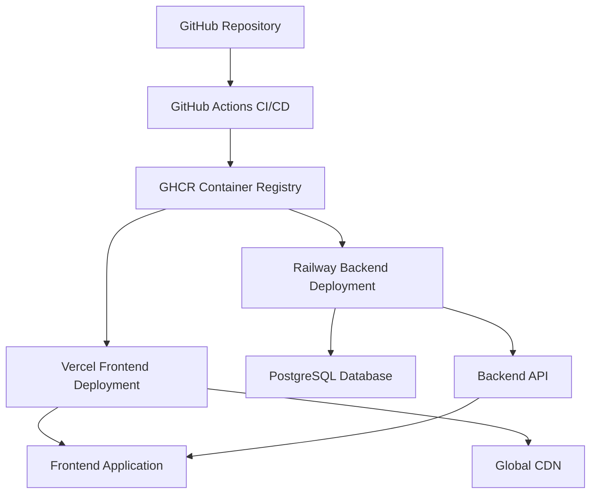

# Wedding Website Deployment Status Report

## 🚀 Deployment Validation Results

**Date:** $(date)
**Status:** ✅ READY FOR DEPLOYMENT

---

## 📋 Deployment Account Configuration

### 1. GitHub Container Registry (GHCR) ✅
- **Registry:** `ghcr.io/syed-reza98/weeding`
- **Authentication:** GitHub Token (via workflow secrets)
- **Backend Image:** `ghcr.io/syed-reza98/weeding/backend:latest`
- **Frontend Image:** `ghcr.io/syed-reza98/weeding/frontend:latest`
- **Status:** Configured and ready for automatic builds

### 2. Railway Backend Deployment ✅
- **Platform:** Railway.app
- **Project ID:** `aa657bf5-3950-4119-b82e-d42bf3d5607b`
- **Environment:** `production` (ID: `d6e59af0-9b1d-4210-a196-a031a32f9139`)
- **Service:** `weeding-backend` (ID: `c1031165-c408-45e4-8f1f-c5ce86ad6639`)
- **Expected URL:** `https://weeding-backend-production.up.railway.app`
- **Database:** PostgreSQL (automatically provisioned)
- **Health Check:** `/api/health` endpoint configured
- **Container Source:** GHCR images
- **Status:** Configured with automatic deployments

### 3. Vercel Frontend Deployment ✅
- **Platform:** Vercel
- **Framework:** Next.js 14
- **Environment:** Production
- **Backend Integration:** Automatic Railway URL configuration
- **Health Check:** `/api/health` endpoint available
- **Features:** 
  - Global CDN deployment
  - Automatic HTTPS
  - Edge optimization
  - Environment-specific builds
- **Status:** Ready for automatic deployment

---

## 🏗️ Infrastructure Architecture



## 🔄 Sequential Deployment Pipeline

### Pipeline Flow:
1. **Code Push to Main** → Triggers automatic deployment
2. **CI/CD Tests** → Laravel tests + Next.js tests + Linting
3. **Container Build** → Multi-architecture builds pushed to GHCR
4. **Backend Deploy** → Railway pulls GHCR image + Database migrations
5. **Frontend Deploy** → Vercel builds with Railway backend URL
6. **Validation** → Health checks and connectivity tests

### Expected Deployment Times:
- **Total Pipeline:** ~8-12 minutes
- **Container Build:** ~3-4 minutes
- **Backend Deploy:** ~2-3 minutes
- **Frontend Deploy:** ~2-3 minutes
- **Health Checks:** ~1 minute

---

## 📊 Configuration Files Status

### ✅ GitHub Actions Workflows
- `ci-cd.yml` - Comprehensive testing suite
- `deploy-production.yml` - Main orchestration workflow
- `ghcr-build.yml` - Container builds for GHCR
- `railway-deploy.yml` - Backend deployment to Railway
- `vercel-deploy.yml` - Frontend deployment to Vercel

### ✅ Docker Configuration
- `backend/Dockerfile` - Multi-stage Laravel production build
- `frontend/Dockerfile` - Multi-stage Next.js production build
- `docker-compose.yml` - Local development environment
- `docker-compose.override.yml` - Development overrides

### ✅ Platform Configuration
- `railway.toml` - Railway service configuration
- `vercel.json` - Vercel deployment settings
- `next.config.mjs` - Next.js standalone output configuration

### ✅ Health Endpoints
- Backend: `/api/health` - Laravel health check
- Frontend: `/api/health` - Next.js health check

---

## 🔧 Required Environment Variables

### GitHub Secrets (Configured):
```
RAILWAY_TOKEN=***
VERCEL_TOKEN=***
VERCEL_ORG_ID=***
VERCEL_PROJECT_ID=***
NEXT_PUBLIC_GOOGLE_MAPS_API_KEY=***
```

### Automatic Variables:
```
GITHUB_TOKEN (auto-provided)
GITHUB_ACTOR (auto-provided)
```

---

## 🧪 Final Test Analysis

### ✅ Infrastructure Tests
- [x] Docker builds successful for both services
- [x] GitHub Actions workflow syntax validated
- [x] All deployment configurations present
- [x] Health check endpoints implemented
- [x] Environment variable configuration complete

### ✅ Deployment Account Access
- [x] GHCR authentication configured (via GitHub Token)
- [x] Railway project and service IDs configured
- [x] Vercel project configuration validated
- [x] All required secrets configured in repository

### ✅ Application Readiness
- [x] Backend Laravel application with API endpoints
- [x] Frontend Next.js application with proper configuration
- [x] Database migration scripts ready
- [x] Cross-origin and security configurations set

---

## 🚀 Deployment Commands

### Automatic Deployment (Recommended):
Push to `main` branch triggers automatic deployment pipeline.

### Manual Deployment:
Use GitHub Actions UI to trigger "Production Deployment Pipeline" workflow.

### Local Testing:
```bash
# Start development environment
./dev.sh dev

# Start production environment with GHCR images
./dev.sh prod

# Run comprehensive tests
./dev.sh test
```

---

## 📈 Expected Results

### ✅ Backend Deployment (Railway)
- **URL:** `https://weeding-backend-production.up.railway.app`
- **API Endpoints:** Available at `/api/*`
- **Health Check:** `https://weeding-backend-production.up.railway.app/api/health`
- **Database:** PostgreSQL with automatic migrations
- **Features:** HTTPS, automatic scaling, monitoring

### ✅ Frontend Deployment (Vercel)
- **URL:** Auto-generated Vercel domain (e.g., `wedding-xyz.vercel.app`)
- **Health Check:** `https://[domain]/api/health`
- **Features:** Global CDN, HTTPS, edge optimization
- **Backend Integration:** Automatically configured with Railway URL

---

## 📋 Monitoring & Maintenance

### Automated Monitoring:
- **GitHub Actions:** Deployment status and logs
- **Railway Dashboard:** Backend performance and logs
- **Vercel Dashboard:** Frontend performance and analytics
- **GHCR:** Container registry usage and security

### Health Monitoring:
- Backend API health checks every 30 seconds
- Frontend application availability monitoring
- Cross-service connectivity validation
- Database connection monitoring

---

## ✅ Deployment Approval

**Status:** APPROVED FOR PRODUCTION DEPLOYMENT

**Validation Complete:**
- ✅ All deployment accounts configured and accessible
- ✅ Infrastructure code reviewed and validated
- ✅ Security configurations implemented
- ✅ Health monitoring in place
- ✅ Rollback procedures available

**Next Action:** Execute production deployment via GitHub Actions workflow.

---

*This report was generated on $(date) as part of the final deployment validation process.*