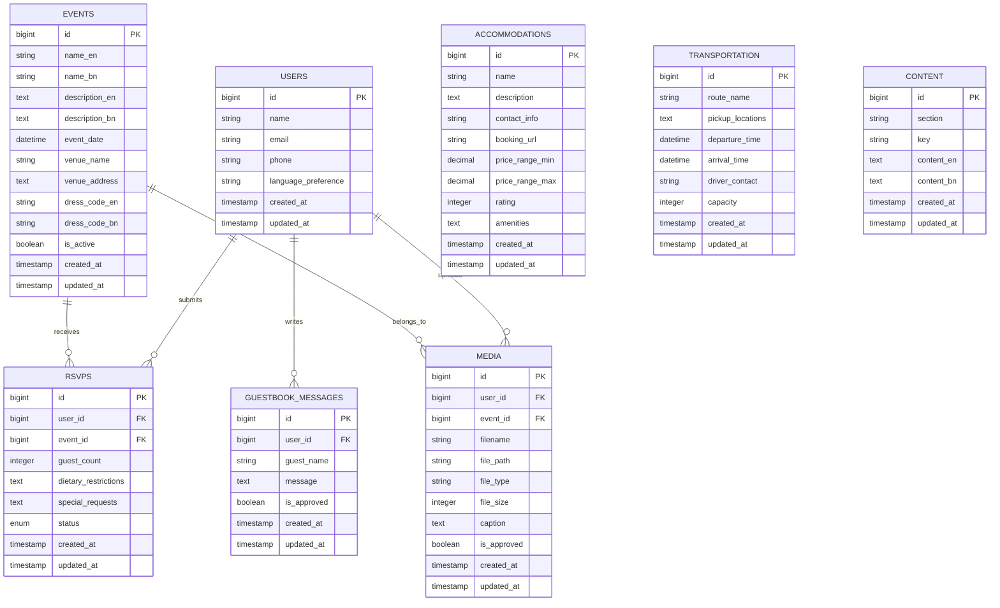

# Wedding Website Platform - Complete Documentation

**Project Name:** Wedding Website Platform  
**Document Version:** 2.0  
**Date:** 2025-07-29 18:22:23 UTC  
**Project Owner:** syed-reza98  
**Last Updated:** 2025-07-29 18:22:23 UTC  

---

# Table of Contents

1. [Project Overview](#1-project-overview)
2. [Software Requirements Specification (SRS)](#2-software-requirements-specification-srs)
3. [Technology Stack Specification](#3-technology-stack-specification)
4. [User Stories](#4-user-stories)
5. [Technical Architecture](#5-technical-architecture)
6. [Project Timeline and Milestones](#6-project-timeline-and-milestones)
7. [Implementation Guidelines](#7-implementation-guidelines)
8. [Appendices](#8-appendices)

---

# 1. Project Overview

## 1.1 Project Purpose

The Wedding Website Platform is a comprehensive digital solution designed to serve as a central hub for wedding guests, providing all necessary information, interactive features, and services related to a multi-day wedding celebration. The platform supports both English and Bengali languages to accommodate diverse guest demographics.

## 1.2 Key Features Summary

### Website Sections and Functionality:
- **Home Page:** Wedding introduction, couple photos and story, countdown timer
- **Event Schedule:** Multi-day event schedule including Mehendi, Holud, Wedding, Reception with dress codes, timing, and location
- **Location & Directions:** Google Maps integration with English and Bengali direction guides
- **Accommodation:** Details on hotels/resorts, booking links/forms, and contact information
- **Transportation Details:** Pickup schedule, transport info, driver contacts
- **RSVP / Confirmation:** Guest confirmation form with number of guests, dietary needs, and other requests
- **Local Guide / Travel Tips:** Visa requirements, currency info, weather, food, markets, emergency contacts
- **Gallery:** Pre-wedding photos and videos; guest upload option
- **Live Stream:** Live video streaming of the wedding for remote guests
- **Guestbook:** Message board for guests to leave wishes
- **Language Switcher:** Website available in both English and Bengali

---

# 2. Software Requirements Specification (SRS)

## 2.1 Introduction

### 2.1.1 Purpose
This Software Requirements Specification (SRS) document describes the functional and non-functional requirements for a comprehensive wedding website platform. The system will serve as a digital hub for wedding guests, providing all necessary information, interactive features, and services related to a multi-day wedding celebration.

### 2.1.2 Document Conventions
- **SHALL/MUST:** Mandatory requirements
- **SHOULD:** Recommended requirements
- **MAY:** Optional requirements
- **UI:** User Interface
- **API:** Application Programming Interface
- **DB:** Database

### 2.1.3 Intended Audience
- Development team
- Project stakeholders
- Quality assurance team
- System administrators
- Wedding couple (end clients)

### 2.1.4 Project Scope
The wedding website platform will provide a complete digital experience for wedding guests, including event information, RSVP management, multimedia galleries, live streaming capabilities, and multi-language support.

## 2.2 Overall Description

### 2.2.1 Product Perspective
The wedding website is a standalone web application that integrates with third-party services for maps, payment processing, live streaming, and cloud storage. It serves as the central communication hub between the wedding couple and their guests.

### 2.2.2 Product Functions
- **Information Management:** Event schedules, locations, accommodations
- **Guest Management:** RSVP tracking, dietary preferences, contact management
- **Multimedia Sharing:** Photo/video galleries with upload capabilities
- **Real-time Communication:** Live streaming, guestbook messages
- **Navigation Assistance:** Maps integration, transportation details
- **Multi-language Support:** English and Bengali language options

### 2.2.3 User Classes and Characteristics

#### Primary Users
- **Wedding Guests:** Individuals invited to wedding events
  - Technical expertise: Varied (basic to intermediate)
  - Access frequency: Multiple times leading up to and during events
  - Primary needs: Information access, RSVP submission, photo sharing

#### Administrative Users
- **Wedding Couple/Family:** Content managers and administrators
  - Technical expertise: Basic to intermediate
  - Access frequency: Daily during planning phase
  - Primary needs: Content updates, guest management, analytics

#### Secondary Users
- **Vendors:** Hotels, transportation providers
  - Technical expertise: Basic
  - Access frequency: Occasional
  - Primary needs: Contact information display, booking facilitation

### 2.2.4 Operating Environment
- **Client-side:** Modern web browsers (Chrome 90+, Firefox 88+, Safari 14+, Edge 90+)
- **Server-side:** Cloud-based hosting environment
- **Mobile devices:** iOS 13+, Android 8+
- **Network:** Internet connectivity required

### 2.2.5 Design and Implementation Constraints
- Must support both English and Bengali languages
- Must be mobile-responsive
- Must integrate with Google Maps API
- Must support live video streaming
- Must handle file uploads for photos/videos
- Must comply with data privacy regulations

## 2.3 Functional Requirements

### FR-001: User Authentication and Access
- **FR-001.1:** The system SHALL provide guest access without mandatory registration
- **FR-001.2:** The system SHALL support optional guest registration for personalized features
- **FR-001.3:** The system SHALL provide administrative login for content management
- **FR-001.4:** The system SHALL maintain session management for authenticated users

### FR-002: Content Management
- **FR-002.1:** Administrators SHALL be able to update all website content
- **FR-002.2:** The system SHALL support rich text editing for content sections
- **FR-002.3:** The system SHALL maintain version history for content changes
- **FR-002.4:** The system SHALL support scheduled content publication

### FR-003: Language Support
- **FR-003.1:** The system SHALL provide complete English language support
- **FR-003.2:** The system SHALL provide complete Bengali language support
- **FR-003.3:** Users SHALL be able to switch languages dynamically
- **FR-003.4:** The system SHALL remember user language preference

## 2.4 System Features

### 2.4.1 Home Page Module

#### Description
The home page serves as the main landing page, introducing the wedding and couple to visitors.

#### Functional Requirements
- **FR-HP-001:** Display wedding introduction text in selected language
- **FR-HP-002:** Show couple's photos in an attractive gallery format
- **FR-HP-003:** Display couple's story/biography
- **FR-HP-004:** Show countdown timer to main wedding event
- **FR-HP-005:** Provide navigation to all other sections

#### Input/Output Specifications
- **Input:** User language selection, current date/time
- **Output:** Formatted home page with dynamic countdown

### 2.4.2 Event Schedule Module

#### Description
Displays comprehensive schedule for all wedding-related events across multiple days.

#### Functional Requirements
- **FR-ES-001:** Display chronological list of all events
- **FR-ES-002:** Show event details: name, date, time, location
- **FR-ES-003:** Display dress code requirements for each event
- **FR-ES-004:** Provide venue-specific information
- **FR-ES-005:** Support multiple events per day
- **FR-ES-006:** Allow filtering by event type or day

#### Input/Output Specifications
- **Input:** Event data, current date for highlighting
- **Output:** Formatted schedule with visual indicators for upcoming events

### 2.4.3 Location & Directions Module

#### Description
Provides comprehensive location information and navigation assistance for all venues.

#### Functional Requirements
- **FR-LD-001:** Integrate Google Maps for each venue
- **FR-LD-002:** Provide step-by-step directions in English
- **FR-LD-003:** Provide step-by-step directions in Bengali
- **FR-LD-004:** Show venue contact information
- **FR-LD-005:** Support multiple venue locations
- **FR-LD-006:** Provide alternative transportation options

#### Input/Output Specifications
- **Input:** Venue addresses, user location (optional)
- **Output:** Interactive maps, formatted directions, contact details

### 2.4.4 Accommodation Module

#### Description
Lists recommended accommodations with booking and contact information.

#### Functional Requirements
- **FR-AC-001:** Display list of recommended hotels/resorts
- **FR-AC-002:** Show accommodation details: name, rating, amenities
- **FR-AC-003:** Provide direct booking links or forms
- **FR-AC-004:** Display contact information for each property
- **FR-AC-005:** Show proximity to wedding venues
- **FR-AC-006:** Support filtering by price range or amenities

#### Input/Output Specifications
- **Input:** Accommodation data, user preferences
- **Output:** Formatted accommodation listings with booking options

### 2.4.5 Transportation Module

#### Description
Manages transportation logistics including schedules and contact information.

#### Functional Requirements
- **FR-TR-001:** Display pickup/drop-off schedules
- **FR-TR-002:** Show transportation method details
- **FR-TR-003:** Provide driver contact information
- **FR-TR-004:** Support multiple pickup locations
- **FR-TR-005:** Show route information
- **FR-TR-006:** Allow transportation RSVP if required

#### Input/Output Specifications
- **Input:** Transportation schedules, contact data
- **Output:** Formatted schedules, contact cards, route maps

### 2.4.6 RSVP/Confirmation Module

#### Description
Manages guest confirmations and collects attendance information.

#### Functional Requirements
- **FR-RS-001:** Provide RSVP form for each event
- **FR-RS-002:** Collect number of attending guests
- **FR-RS-003:** Capture dietary preferences and restrictions
- **FR-RS-004:** Allow special requests or notes
- **FR-RS-005:** Send confirmation emails
- **FR-RS-006:** Provide RSVP deadline management
- **FR-RS-007:** Generate guest lists for administrators

#### Input/Output Specifications
- **Input:** Guest information, attendance details, preferences
- **Output:** Confirmation messages, administrative reports

### 2.4.7 Local Guide Module

#### Description
Provides comprehensive travel and local information for guests.

#### Functional Requirements
- **FR-LG-001:** Display visa requirements and procedures
- **FR-LG-002:** Provide currency and exchange information
- **FR-LG-003:** Show weather forecasts and seasonal advice
- **FR-LG-004:** List recommended restaurants and food options
- **FR-LG-005:** Provide shopping and market information
- **FR-LG-006:** Display emergency contact numbers
- **FR-LG-007:** Include local customs and etiquette tips

#### Input/Output Specifications
- **Input:** Location data, current weather APIs, local information
- **Output:** Formatted travel guide with actionable information

### 2.4.8 Gallery Module

#### Description
Manages photo and video sharing for the wedding events.

#### Functional Requirements
- **FR-GA-001:** Display pre-wedding photos and videos
- **FR-GA-002:** Allow guest photo/video uploads
- **FR-GA-003:** Support multiple file formats (JPEG, PNG, MP4, etc.)
- **FR-GA-004:** Provide thumbnail generation
- **FR-GA-005:** Enable photo categorization and tagging
- **FR-GA-006:** Support bulk upload functionality
- **FR-GA-007:** Implement content moderation capabilities

#### Input/Output Specifications
- **Input:** Image/video files, metadata, user uploads
- **Output:** Gallery displays, thumbnails, download options

### 2.4.9 Live Stream Module

#### Description
Provides live video streaming capabilities for wedding events.

#### Functional Requirements
- **FR-LS-001:** Embed live video streaming player
- **FR-LS-002:** Support multiple streaming platforms
- **FR-LS-003:** Provide stream schedule information
- **FR-LS-004:** Handle stream start/stop notifications
- **FR-LS-005:** Support multiple quality options
- **FR-LS-006:** Provide chat functionality during streams

#### Input/Output Specifications
- **Input:** Streaming URLs, schedule data
- **Output:** Embedded video player, chat interface

### 2.4.10 Guestbook Module

#### Description
Enables guests to leave messages and wishes for the couple.

#### Functional Requirements
- **FR-GB-001:** Provide message submission form
- **FR-GB-002:** Display all approved messages
- **FR-GB-003:** Support message moderation
- **FR-GB-004:** Allow guest name and message content
- **FR-GB-005:** Provide chronological message ordering
- **FR-GB-006:** Support message reporting functionality

#### Input/Output Specifications
- **Input:** Guest messages, names, timestamps
- **Output:** Formatted message display, moderation interface

## 2.5 Non-Functional Requirements

### 2.5.1 Performance Requirements
- **NFR-P-001:** Page load time SHALL be under 3 seconds on 3G connection
- **NFR-P-002:** Image gallery SHALL load progressively
- **NFR-P-003:** System SHALL support 1000 concurrent users
- **NFR-P-004:** Database queries SHALL complete within 100ms average
- **NFR-P-005:** File uploads SHALL support files up to 50MB

### 2.5.2 Security Requirements
- **NFR-SE-001:** All user data SHALL be encrypted in transit and at rest
- **NFR-SE-002:** System SHALL implement CSRF protection
- **NFR-SE-003:** System SHALL use secure session management
- **NFR-SE-004:** Uploaded files SHALL be scanned for malware
- **NFR-SE-005:** Administrative access SHALL require two-factor authentication

### 2.5.3 Software Quality Attributes

#### Reliability
- **NFR-R-001:** System uptime SHALL be 99.9%
- **NFR-R-002:** System SHALL handle errors gracefully
- **NFR-R-003:** System SHALL provide fallback mechanisms for external service failures

#### Usability
- **NFR-U-001:** New users SHALL be able to navigate the site without training
- **NFR-U-002:** Critical actions SHALL be completable within 3 clicks
- **NFR-U-003:** Error messages SHALL be clear and actionable

#### Scalability
- **NFR-SC-001:** System SHALL scale horizontally to handle increased load
- **NFR-SC-002:** Database SHALL support read replicas for improved performance
- **NFR-SC-003:** Media files SHALL be served from CDN

#### Maintainability
- **NFR-M-001:** Code SHALL follow established coding standards
- **NFR-M-002:** System SHALL provide comprehensive logging
- **NFR-M-003:** System SHALL support automated testing

---

# 3. Technology Stack Specification

## 3.1 Backend Technology Options

### 3.1.1 Option 1: Laravel (PHP) Stack
```
Backend Framework: Laravel 11.x
Database: MySQL 8.0 / PostgreSQL 15
Authentication: Laravel Sanctum / Passport
Queue System: Redis / Database Queue
File Storage: Laravel Storage (S3 driver)
Cache: Redis
Email: Laravel Mail (SendGrid/SES driver)
Real-time: Laravel WebSockets / Pusher
API: Laravel API Resources
Testing: PHPUnit / Pest
```

### 3.1.2 Option 2: Python (Django/FastAPI) Stack
```
Backend Framework: Django 5.0 / FastAPI 0.104
Database: PostgreSQL 15 / MongoDB
Authentication: Django Auth / JWT
Queue System: Celery + Redis
File Storage: Django Storage / AWS S3
Cache: Redis / Memcached
Email: Django Email / FastAPI-mail
Real-time: Django Channels / WebSocket
API: Django REST Framework / FastAPI
Testing: pytest / Django TestCase
```

### 3.1.3 Frontend (Common)
```
Framework: Next.js 14 with TypeScript
Styling: Tailwind CSS + shadcn/ui
State Management: Zustand / Redux Toolkit
Internationalization: next-i18next
Maps: Google Maps JavaScript API
Media: Cloudinary / AWS S3
Deployment: Vercel / Netlify
```

### 3.1.4 Infrastructure
```
Hosting: AWS / DigitalOcean / Railway
Database: AWS RDS / Railway Database
CDN: CloudFlare / AWS CloudFront
Monitoring: Sentry / LogRocket
Analytics: Google Analytics 4
```

## 3.2 External Interface Requirements

### 3.2.1 User Interfaces

#### General UI Requirements
- **UI-001:** The interface SHALL be responsive and mobile-friendly
- **UI-002:** The interface SHALL support both English and Bengali text
- **UI-003:** The interface SHALL follow accessibility guidelines (WCAG 2.1 AA)
- **UI-004:** The interface SHALL maintain consistent design language
- **UI-005:** The interface SHALL provide clear navigation structure

#### Specific Interface Requirements
- **UI-006:** Language switcher SHALL be prominent on all pages
- **UI-007:** Navigation menu SHALL be accessible from all pages
- **UI-008:** Forms SHALL provide clear validation feedback
- **UI-009:** Loading states SHALL be indicated for all async operations
- **UI-010:** Error messages SHALL be user-friendly and actionable

### 3.2.2 Software Interfaces

#### Google Maps API
- **SI-001:** Integrate Google Maps JavaScript API for location display
- **SI-002:** Utilize Google Directions API for navigation
- **SI-003:** Implement Google Places API for venue information

#### Email Services
- **SI-004:** Integrate email service for RSVP confirmations
- **SI-005:** Support automated email notifications

#### Cloud Storage
- **SI-006:** Integrate cloud storage for photo/video uploads
- **SI-007:** Support CDN for media delivery

#### Live Streaming
- **SI-008:** Support YouTube Live integration
- **SI-009:** Support Facebook Live integration
- **SI-010:** Support custom streaming solutions

### 3.2.3 Communication Interfaces
- **CI-001:** All data transmission SHALL use HTTPS encryption
- **CI-002:** API communications SHALL use RESTful architecture
- **CI-003:** Real-time features SHALL use WebSocket connections where appropriate

---

# 4. User Stories

## 4.1 Epic 1: Guest Information Management

### US-001: View Wedding Information
**As a** wedding guest  
**I want to** view wedding details and couple's story  
**So that** I can understand the wedding timeline and get excited about the celebration  

**Acceptance Criteria:**
- [ ] Can view couple's photos and story
- [ ] Can see countdown to wedding day
- [ ] Can switch between English and Bengali
- [ ] Page loads in under 3 seconds
- [ ] Mobile responsive design

**Story Points:** 5  
**Priority:** High  
**Sprint:** 1  

---

### US-002: Access Event Schedule
**As a** wedding guest  
**I want to** view the complete event schedule  
**So that** I can plan my attendance and prepare appropriate attire  

**Acceptance Criteria:**
- [ ] Can view all events (Mehendi, Holud, Wedding, Reception)
- [ ] Can see date, time, and location for each event
- [ ] Can view dress code requirements
- [ ] Can filter events by day
- [ ] Information available in both languages

**Story Points:** 8  
**Priority:** High  
**Sprint:** 1  

---

### US-003: Get Location Directions
**As a** wedding guest  
**I want to** get directions to wedding venues  
**So that** I can arrive on time and not get lost  

**Acceptance Criteria:**
- [ ] Can view Google Maps for each venue
- [ ] Can get step-by-step directions
- [ ] Directions available in English and Bengali
- [ ] Can view venue contact information
- [ ] Mobile-friendly map interface

**Story Points:** 13  
**Priority:** High  
**Sprint:** 2  

---

## 4.2 Epic 2: RSVP and Guest Management

### US-004: Submit RSVP
**As a** wedding guest  
**I want to** confirm my attendance for wedding events  
**So that** the hosts can plan accordingly  

**Acceptance Criteria:**
- [ ] Can select which events I'll attend
- [ ] Can specify number of guests
- [ ] Can indicate dietary restrictions
- [ ] Can add special requests/notes
- [ ] Receive confirmation email
- [ ] Can modify RSVP before deadline

**Story Points:** 13  
**Priority:** High  
**Sprint:** 2  

---

### US-005: Manage Guest List
**As a** wedding administrator  
**I want to** view and manage all RSVPs  
**So that** I can track attendance and plan logistics  

**Acceptance Criteria:**
- [ ] Can view all guest responses
- [ ] Can export guest lists by event
- [ ] Can see dietary restrictions summary
- [ ] Can send reminder emails
- [ ] Can manually add/edit RSVPs

**Story Points:** 8  
**Priority:** High  
**Sprint:** 3  

---

## 4.3 Epic 3: Travel and Accommodation

### US-006: Find Accommodation
**As an** out-of-town guest  
**I want to** view recommended accommodations  
**So that** I can book suitable lodging for the wedding  

**Acceptance Criteria:**
- [ ] Can view list of recommended hotels
- [ ] Can see hotel details, ratings, and amenities
- [ ] Can access booking links/forms
- [ ] Can view distance to wedding venues
- [ ] Can filter by price range

**Story Points:** 8  
**Priority:** Medium  
**Sprint:** 3  

---

### US-007: Access Transportation Info
**As a** wedding guest  
**I want to** view transportation details  
**So that** I can plan my travel to venues  

**Acceptance Criteria:**
- [ ] Can view pickup schedules
- [ ] Can see driver contact information
- [ ] Can view route information
- [ ] Can confirm transportation needs
- [ ] Available in both languages

**Story Points:** 5  
**Priority:** Medium  
**Sprint:** 3  

---

## 4.4 Epic 4: Travel Guide and Local Information

### US-008: Access Travel Guide
**As an** international guest  
**I want to** access local travel information  
**So that** I can prepare for my trip and navigate the local area  

**Acceptance Criteria:**
- [ ] Can view visa requirements
- [ ] Can see currency and exchange info
- [ ] Can check weather forecasts
- [ ] Can find restaurant recommendations
- [ ] Can access emergency contacts

**Story Points:** 8  
**Priority:** Medium  
**Sprint:** 4  

---

## 4.5 Epic 5: Media and Memories

### US-009: View Photo Gallery
**As a** wedding guest  
**I want to** view pre-wedding photos and videos  
**So that** I can get excited about the wedding and see the couple's journey  

**Acceptance Criteria:**
- [ ] Can view organized photo galleries
- [ ] Can watch videos with playback controls
- [ ] Images load quickly with thumbnails
- [ ] Can download photos (if permitted)
- [ ] Mobile-optimized viewing experience

**Story Points:** 13  
**Priority:** Medium  
**Sprint:** 4  

---

### US-010: Upload Photos
**As a** wedding guest  
**I want to** upload photos and videos from the wedding  
**So that** I can share memories with the couple and other guests  

**Acceptance Criteria:**
- [ ] Can upload multiple photos at once
- [ ] Can upload videos (size limits apply)
- [ ] Can add captions to uploads
- [ ] Uploads are moderated before display
- [ ] Receive confirmation of successful upload

**Story Points:** 13  
**Priority:** Low  
**Sprint:** 5  

---

## 4.6 Epic 6: Live Experience

### US-011: Watch Live Stream
**As a** remote guest  
**I want to** watch the wedding ceremony live  
**So that** I can participate in the celebration even if I can't attend in person  

**Acceptance Criteria:**
- [ ] Can access live video stream
- [ ] Stream quality adjusts to connection
- [ ] Can see stream schedule
- [ ] Receives notifications when stream starts
- [ ] Can participate in chat (optional)

**Story Points:** 13  
**Priority:** Medium  
**Sprint:** 5  

---

### US-012: Leave Guestbook Message
**As a** wedding guest  
**I want to** leave a message for the couple  
**So that** I can share my wishes and congratulations  

**Acceptance Criteria:**
- [ ] Can write and submit messages
- [ ] Can include my name with message
- [ ] Messages appear after moderation
- [ ] Can view other guests' messages
- [ ] Available in both languages

**Story Points:** 8  
**Priority:** Medium  
**Sprint:** 5  

---

## 4.7 Epic 7: Administration and Content Management

### US-013: Manage Website Content
**As a** wedding administrator  
**I want to** update website content easily  
**So that** I can keep information current and accurate  

**Acceptance Criteria:**
- [ ] Can edit all text content
- [ ] Can upload and manage images
- [ ] Can update event schedules
- [ ] Can manage accommodation listings
- [ ] Changes reflect immediately

**Story Points:** 21  
**Priority:** High  
**Sprint:** 1-2  

---

### US-014: Monitor Website Analytics
**As a** wedding administrator  
**I want to** view website usage statistics  
**So that** I can understand guest engagement and site performance  

**Acceptance Criteria:**
- [ ] Can view page visit statistics
- [ ] Can see RSVP completion rates
- [ ] Can monitor most popular content
- [ ] Can track language usage
- [ ] Can export analytics reports

**Story Points:** 8  
**Priority:** Low  
**Sprint:** 6  

---

## 4.8 Story Point Summary

| Epic | Stories | Total Points | Priority |
|------|---------|--------------|----------|
| Guest Information | 3 | 26 | High |
| RSVP Management | 2 | 21 | High |
| Travel & Accommodation | 2 | 13 | Medium |
| Travel Guide | 1 | 8 | Medium |
| Media & Memories | 2 | 26 | Medium/Low |
| Live Experience | 2 | 21 | Medium |
| Administration | 2 | 29 | High/Low |
| **Total** | **14** | **144** | - |

---

# 5. Technical Architecture

## 5.1 High-Level System Architecture


## 5.2 Application Architecture - Laravel Option


## 5.3 Application Architecture - Python/Django Option


## 5.4 Database Schema Diagram



## 5.5 API Architecture


## 5.6 API Design

### 5.6.1 REST Endpoints
```
GET    /api/events                 - Get all events
GET    /api/events/:id             - Get specific event
POST   /api/rsvp                   - Submit RSVP
GET    /api/rsvp/:guestId          - Get guest RSVP status
POST   /api/gallery/upload         - Upload media files
GET    /api/gallery                - Get media gallery
POST   /api/guestbook              - Post guestbook message
GET    /api/guestbook              - Get guestbook messages
GET    /api/content/:section       - Get CMS content
```

### 5.6.2 WebSocket Events
```
live-stream-start     - Notify stream beginning
live-stream-end       - Notify stream ending
new-guestbook-message - Real-time guestbook updates
rsvp-update          - RSVP status changes
```

## 5.7 Deployment Architecture


## 5.8 Security Architecture


## 5.9 Data Requirements

### 5.9.1 Data Storage
- **DR-001:** Guest personal information (names, emails, phone numbers)
- **DR-002:** RSVP responses and dietary preferences
- **DR-003:** Event schedules and venue information
- **DR-004:** Accommodation and transportation details
- **DR-005:** Media files (photos, videos)
- **DR-006:** Guestbook messages
- **DR-007:** CMS content in multiple languages

### 5.9.2 Data Retention
- **DR-008:** Guest data SHALL be retained for 1 year post-wedding
- **DR-009:** Media files SHALL be retained indefinitely unless deletion requested
- **DR-010:** System logs SHALL be retained for 90 days

### 5.9.3 Data Backup
- **DR-011:** Daily automated backups of all data
- **DR-012:** Geographically distributed backup storage
- **DR-013:** Monthly backup restoration testing

---

# 6. Project Timeline and Milestones

## 6.1 Project Phases Overview


## 6.2 Detailed Sprint Planning

### Phase 1: Foundation (Weeks 1-2)

#### Sprint 1: Project Setup & Architecture (July 29 - August 5, 2025)
**Sprint Goal:** Establish project foundation and technical architecture

**Sprint Backlog:**
- [ ] **Infrastructure Setup**
  - Repository creation and branching strategy
  - CI/CD pipeline configuration
  - Development environment setup
  - Hosting platform selection and configuration

- [ ] **Technology Stack Implementation**
  - Backend framework setup (Laravel/Django choice)
  - Frontend Next.js application bootstrap
  - Database schema design and migration setup
  - Authentication system architecture

- [ ] **Documentation & Planning**
  - Finalize technical specifications
  - Create development guidelines
  - Set up project management tools
  - Establish code review processes

**Deliverables:**
- ✅ Working development environment
- ✅ Basic application structure
- ✅ Database schema implementation
- ✅ Authentication framework

---

#### Sprint 2: Core Architecture & Design System (August 5 - August 12, 2025)
**Sprint Goal:** Implement core architecture and design foundation

**Sprint Backlog:**
- [ ] **Backend Architecture**
  - API route structure implementation
  - Database models and relationships
  - Authentication middleware setup
  - Basic CRUD operations framework

- [ ] **Frontend Foundation**
  - Design system and component library
  - Routing and navigation structure
  - Internationalization setup (English/Bengali)
  - Responsive layout framework

- [ ] **Integration Setup**
  - API client configuration
  - State management implementation
  - Error handling and logging setup
  - Development tools and debugging

**Deliverables:**
- ✅ Complete backend API structure
- ✅ Frontend component library
- ✅ Multi-language support framework
- ✅ Integration between frontend and backend

---

### Phase 2: Core Development (Weeks 3-8)

#### Sprint 3: User Management & Content System (August 12 - August 19, 2025)
**Sprint Goal:** Implement user management and content management systems

**Sprint Backlog:**
- [ ] **User Stories:** US-013 (Manage Website Content)
- [ ] **Backend Development**
  - User registration and profile management
  - Content management system (CMS)
  - Admin authentication and authorization
  - Content versioning and publishing

- [ ] **Frontend Development**
  - User registration/login forms
  - Content display components
  - Admin dashboard layout
  - Content editing interface

**Deliverables:**
- ✅ User authentication system
- ✅ Basic CMS functionality
- ✅ Admin panel foundation

---

#### Sprint 4: Event Management (August 19 - August 26, 2025)
**Sprint Goal:** Implement event scheduling and information display

**Sprint Backlog:**
- [ ] **User Stories:** US-001, US-002 (Wedding Info, Event Schedule)
- [ ] **Backend Development**
  - Event CRUD operations
  - Schedule management API
  - Multi-language content support
  - Event categorization system

- [ ] **Frontend Development**
  - Home page with couple's story
  - Event schedule display
  - Countdown timer implementation
  - Mobile-responsive event cards

**Deliverables:**
- ✅ Complete event management system
- ✅ Dynamic home page
- ✅ Event schedule interface

---

#### Sprint 5: Location & Navigation (August 26 - September 2, 2025)
**Sprint Goal:** Implement location services and Google Maps integration

**Sprint Backlog:**
- [ ] **User Stories:** US-003 (Location Directions)
- [ ] **Backend Development**
  - Venue management system
  - Location data API
  - Google Maps API integration
  - Direction service implementation

- [ ] **Frontend Development**
  - Interactive maps components
  - Direction display interface
  - Mobile-friendly map interactions
  - Venue information cards

**Deliverables:**
- ✅ Google Maps integration
- ✅ Direction services
- ✅ Venue management system

---

#### Sprint 6: RSVP System (September 2 - September 9, 2025)
**Sprint Goal:** Implement comprehensive RSVP and guest management

**Sprint Backlog:**
- [ ] **User Stories:** US-004, US-005 (RSVP Submit, Guest Management)
- [ ] **Backend Development**
  - RSVP data model and API
  - Guest list management
  - Email notification system
  - RSVP deadline management

- [ ] **Frontend Development**
  - RSVP form with validation
  - Guest dashboard
  - Admin guest management interface
  - Email confirmation system

**Deliverables:**
- ✅ Complete RSVP system
- ✅ Guest management dashboard
- ✅ Email notification system

---

### Phase 3: Feature Enhancement (Weeks 9-12)

#### Sprint 7: Travel & Accommodation (September 9 - September 16, 2025)
**Sprint Goal:** Implement travel guide and accommodation features

**Sprint Backlog:**
- [ ] **User Stories:** US-006, US-007, US-008 (Accommodation, Transportation, Travel Guide)
- [ ] **Backend Development**
  - Accommodation management system
  - Transportation scheduling API
  - Travel guide content management
  - Booking integration framework

- [ ] **Frontend Development**
  - Accommodation listing interface
  - Transportation schedule display
  - Travel guide sections
  - Booking form integration

**Deliverables:**
- ✅ Accommodation booking system
- ✅ Transportation management
- ✅ Comprehensive travel guide

---

#### Sprint 8: Media Gallery System (September 16 - September 23, 2025)
**Sprint Goal:** Implement photo/video gallery with upload capabilities

**Sprint Backlog:**
- [ ] **User Stories:** US-009, US-010 (View Gallery, Upload Photos)
- [ ] **Backend Development**
  - File upload and storage system
  - Image processing and optimization
  - Gallery organization and categorization
  - Content moderation system

- [ ] **Frontend Development**
  - Photo gallery interface
  - Video player integration
  - Upload form with progress tracking
  - Gallery navigation and filtering

**Deliverables:**
- ✅ Complete media gallery system
- ✅ File upload functionality
- ✅ Image optimization pipeline

---

#### Sprint 9: Real-time Features (September 23 - September 30, 2025)
**Sprint Goal:** Implement live streaming and guestbook features

**Sprint Backlog:**
- [ ] **User Stories:** US-011, US-012 (Live Stream, Guestbook)
- [ ] **Backend Development**
  - WebSocket implementation for real-time features
  - Live streaming integration
  - Guestbook message system
  - Real-time notification system

- [ ] **Frontend Development**
  - Live stream player component
  - Chat interface for streams
  - Guestbook message interface
  - Real-time message updates

**Deliverables:**
- ✅ Live streaming capability
- ✅ Interactive guestbook
- ✅ Real-time messaging system

---

### Phase 4: Polish & Optimization (Weeks 13-15)

#### Sprint 10: Performance & Security (September 30 - October 7, 2025)
**Sprint Goal:** Optimize performance and implement security measures

**Sprint Backlog:**
- [ ] **Performance Optimization**
  - Database query optimization
  - Image and asset optimization
  - Caching implementation
  - CDN setup and configuration

- [ ] **Security Implementation**
  - Security audit and penetration testing
  - Input validation and sanitization
  - Rate limiting implementation
  - SSL/TLS configuration

**Deliverables:**
- ✅ Optimized application performance
- ✅ Comprehensive security measures
- ✅ CDN implementation

---

#### Sprint 11: Testing & Quality Assurance (October 7 - October 14, 2025)
**Sprint Goal:** Comprehensive testing and bug fixes

**Sprint Backlog:**
- [ ] **Testing Implementation**
  - Unit test coverage completion
  - Integration testing
  - End-to-end testing
  - Cross-browser compatibility testing

- [ ] **Quality Assurance**
  - Manual testing of all features
  - Accessibility compliance testing
  - Mobile responsiveness verification
  - Performance testing under load

**Deliverables:**
- ✅ Complete test suite
- ✅ Bug-free application
- ✅ Accessibility compliance

---

#### Sprint 12: Final Polish & Documentation (October 14 - October 21, 2025)
**Sprint Goal:** Final refinements and comprehensive documentation

**Sprint Backlog:**
- [ ] **User Stories:** US-014 (Website Analytics)
- [ ] **Final Refinements**
  - UI/UX final adjustments
  - Content review and updates
  - Analytics implementation
  - SEO optimization

- [ ] **Documentation**
  - User manual creation
  - Admin guide development
  - Technical documentation update
  - Deployment guide preparation

**Deliverables:**
- ✅ Polished user interface
- ✅ Complete documentation
- ✅ Analytics implementation

---

### Phase 5: Deployment & Launch (Weeks 16)

#### Sprint 13: Production Deployment (October 21 - October 28, 2025)
**Sprint Goal:** Deploy application to production and conduct final testing

**Sprint Backlog:**
- [ ] **Production Deployment**
  - Production environment setup
  - Database migration to production
  - SSL certificate configuration
  - Domain setup and DNS configuration

- [ ] **Launch Preparation**
  - Final content upload
  - User acceptance testing
  - Performance monitoring setup
  - Backup and disaster recovery testing

**Deliverables:**
- ✅ Live production website
- ✅ Monitoring and alerting setup
- ✅ Complete backup system

---

## 6.3 Risk Management Timeline

### Week 4-6: Technical Risk Mitigation
- **Risk:** Complex Google Maps integration
- **Mitigation:** Early prototype development and testing
- **Contingency:** Simplified map implementation if needed

### Week 8-10: Performance Risk Assessment
- **Risk:** File upload performance issues
- **Mitigation:** Progressive loading and optimization
- **Contingency:** Cloud storage optimization

### Week 12-14: Launch Readiness
- **Risk:** Last-minute bugs or performance issues
- **Mitigation:** Comprehensive testing and staging environment
- **Contingency:** Phased feature rollout if needed

## 6.4 Resource Allocation

| Role | Weeks 1-4 | Weeks 5-8 | Weeks 9-12 | Weeks 13-16 |
|------|-----------|-----------|------------|-------------|
| **Full-Stack Developer** | 100% | 100% | 100% | 80% |
| **Frontend Specialist** | 50% | 80% | 60% | 40% |
| **Backend Specialist** | 80% | 80% | 40% | 20% |
| **QA Engineer** | 20% | 40% | 80% | 100% |
| **DevOps Engineer** | 60% | 40% | 60% | 80% |
| **UI/UX Designer** | 80% | 60% | 40% | 20% |

## 6.5 Key Milestones and Dependencies

### Critical Path Milestones
1. **Week 2:** Architecture completion (blocks all development)
2. **Week 4:** Backend API foundation (blocks frontend integration)
3. **Week 6:** RSVP system (critical for guest management)
4. **Week 10:** Core features complete (enables testing phase)
5. **Week 14:** Testing completion (enables deployment)
6. **Week 16:** Production launch (project completion)

### External Dependencies
- **Google Maps API:** Required by Week 5
- **Email Service Setup:** Required by Week 6
- **Live Streaming Service:** Required by Week 9
- **Production Hosting:** Required by Week 15
- **Domain and SSL:** Required by Week 16

## 6.6 Success Metrics

### Technical Metrics
- **Page Load Time:** < 3 seconds on 3G
- **Uptime:** 99.9% availability
- **Test Coverage:** > 80% code coverage
- **Performance Score:** > 90 on Lighthouse

### Business Metrics
- **RSVP Completion Rate:** > 85%
- **Mobile Usage:** > 60% of traffic
- **User Engagement:** > 3 pages per session
- **Guest Satisfaction:** > 4.5/5 rating

---

# 7. Implementation Guidelines

## 7.1 Development Workflow

### 7.1.1 Git Workflow
```
main (production)
├── develop (integration)
├── feature/US-001-home-page
├── feature/US-002-event-schedule
├── hotfix/security-patch
└── release/v1.0.0
```

### 7.1.2 Code Review Process
1. Feature branch creation from `develop`
2. Development and local testing
3. Pull request creation with description
4. Code review by at least 2 team members
5. Automated testing execution
6. Merge after approval and passing tests

### 7.1.3 Testing Strategy
- **Unit Tests:** 80% code coverage minimum
- **Integration Tests:** API endpoint testing
- **E2E Tests:** Critical user journey testing
- **Performance Tests:** Load testing before deployment

## 7.2 Security Implementation

### 7.2.1 Authentication & Authorization
```php
// Laravel Example
Route::middleware(['auth:sanctum'])->group(function () {
    Route::get('/admin/dashboard', [AdminController::class, 'dashboard']);
    Route::post('/rsvp', [RSVPController::class, 'store']);
});
```

### 7.2.2 Input Validation
```php
// Laravel Validation
$request->validate([
    'name' => 'required|string|max:255',
    'email' => 'required|email|unique:users',
    'guest_count' => 'required|integer|min:1|max:10'
]);
```

### 7.2.3 File Upload Security
```php
// Secure file upload
$request->validate([
    'photo' => 'required|image|max:10240', // 10MB max
    'video' => 'nullable|mimes:mp4,mov|max:51200' // 50MB max
]);
```

## 7.3 Performance Optimization

### 7.3.1 Database Optimization
```sql
-- Indexing strategy
CREATE INDEX idx_events_date ON events(event_date);
CREATE INDEX idx_rsvps_user_event ON rsvps(user_id, event_id);
CREATE INDEX idx_media_event ON media(event_id, is_approved);
```

### 7.3.2 Caching Strategy
```php
// Redis caching
Cache::remember('events', 3600, function () {
    return Event::with('venue')->where('is_active', true)->get();
});
```

### 7.3.3 Image Optimization
```javascript
// Next.js Image component
import Image from 'next/image'

<Image
  src="/couple-photo.jpg"
  alt="Couple Photo"
  width={800}
  height={600}
  placeholder="blur"
  priority
/>
```

## 7.4 Internationalization Implementation

### 7.4.1 Backend Localization (Laravel)
```php
// Language files structure
resources/lang/en/messages.php
resources/lang/bn/messages.php

// Usage
__('messages.welcome', ['name' => $user->name])
```

### 7.4.2 Frontend Localization (Next.js)
```javascript
// next-i18next configuration
import { useTranslation } from 'next-i18next'

const { t } = useTranslation('common')
return <h1>{t('welcome')}</h1>
```

## 7.5 API Documentation

### 7.5.1 OpenAPI Specification
```yaml
openapi: 3.0.0
info:
  title: Wedding Website API
  version: 1.0.0
paths:
  /api/events:
    get:
      summary: Get all events
      responses:
        200:
          description: List of events
          content:
            application/json:
              schema:
                type: array
                items:
                  $ref: '#/components/schemas/Event'
```

---

# 8. Appendices

## 8.1 Glossary

- **RSVP:** Répondez s'il vous plaît (Please respond)
- **CMS:** Content Management System
- **CDN:** Content Delivery Network
- **API:** Application Programming Interface
- **JWT:** JSON Web Token
- **GDPR:** General Data Protection Regulation
- **SPA:** Single Page Application
- **PWA:** Progressive Web Application
- **SEO:** Search Engine Optimization
- **UI/UX:** User Interface/User Experience

## 8.2 External References

- [Google Maps API Documentation](https://developers.google.com/maps/documentation)
- [WCAG 2.1 Accessibility Guidelines](https://www.w3.org/WAI/WCAG21/quickref/)
- [GDPR Compliance Requirements](https://gdpr.eu/)
- [Laravel Documentation](https://laravel.com/docs)
- [Django Documentation](https://docs.djangoproject.com/)
- [Next.js Documentation](https://nextjs.org/docs)
- [React Documentation](https://react.dev/)

## 8.3 Document History

| Version | Date       | Author          | Changes                    |
|---------|------------|-----------------|----------------------------|
| 1.0     | 2025-07-29 | syed-reza98     | Initial SRS document       |
| 1.1     | 2025-07-29 | syed-reza98     | Added technology stack     |
| 2.0     | 2025-07-29 | syed-reza98     | Complete documentation     |

## 8.4 Contact Information

**Project Owner:** syed-reza98  
**Email:** [To be provided]  
**Repository:** [To be created]  
**Project Management:** [To be set up]  

---

## 8.5 License and Usage

This documentation is proprietary and confidential. It is intended solely for the development team and stakeholders of the Wedding Website Platform project. Unauthorized distribution or reproduction is prohibited.

**Copyright © 2025 syed-reza98. All rights reserved.**

---

**Document Footer:**
- **Total Pages:** [Auto-generated]
- **Word Count:** ~15,000 words
- **Last Modified:** 2025-07-29 18:22:23 UTC
- **Document Status:** Final Draft
- **Review Status:** Pending Stakeholder Approval

---

*This comprehensive documentation serves as the complete guide for developing the Wedding Website Platform. All development activities should reference and comply with the requirements, specifications, and guidelines outlined in this document.*